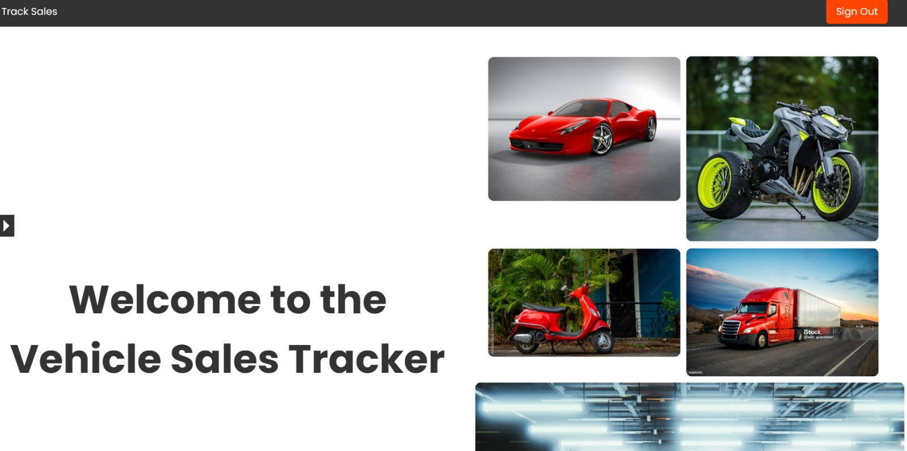
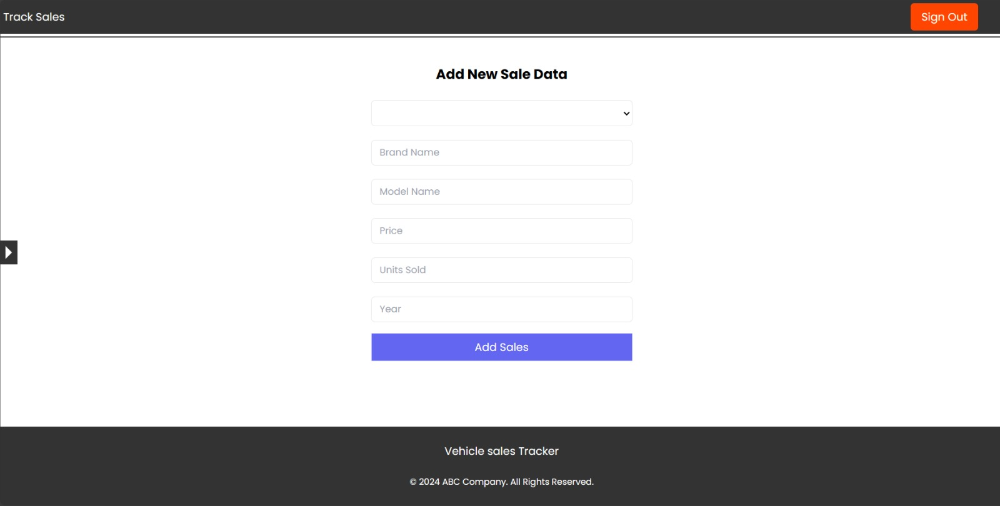
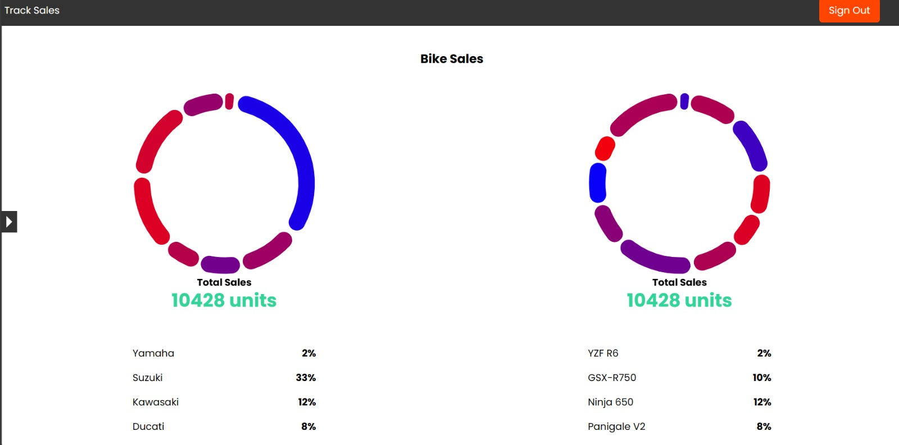
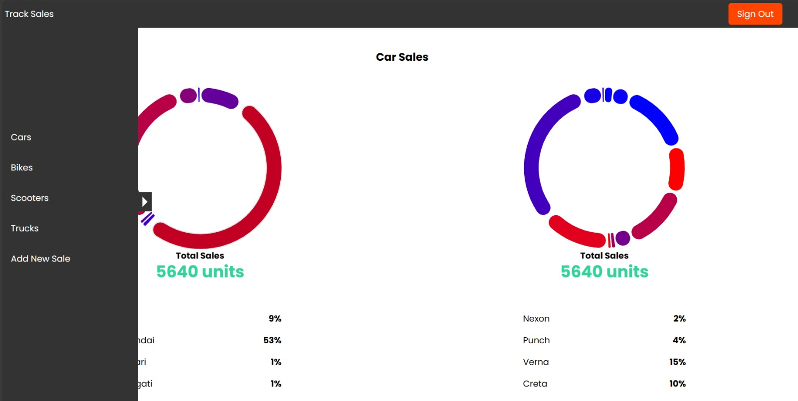
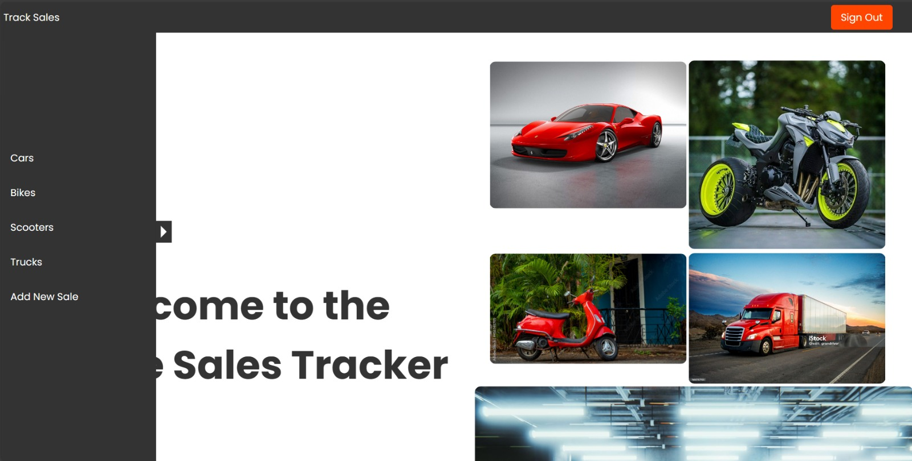
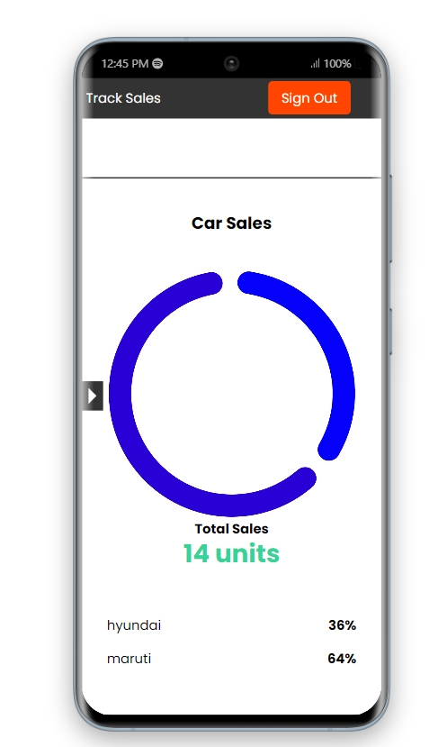
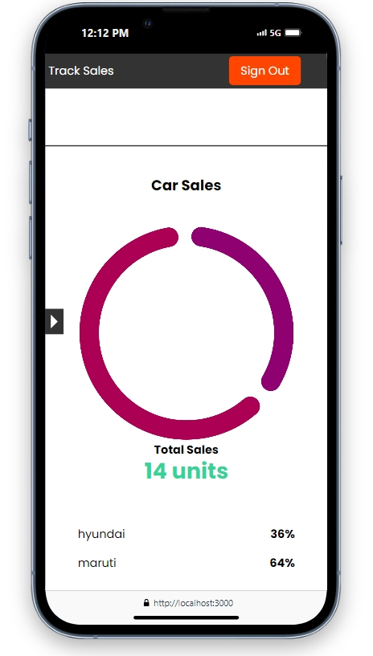
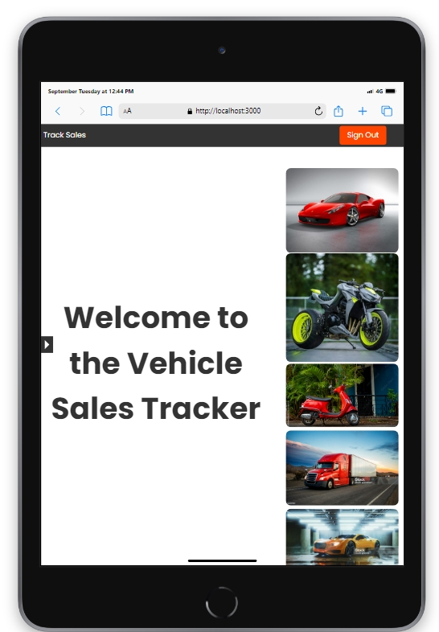

<h1 align="center">Vehicle Sales Tracker</h1>

Vehicle Sales Tracker Using Mern Stack Development

## Table of Contents

- [Project Purpose](#project-purpose)
- [Technologies](#technologies)
- [Quick Tour](#quick-tour)
- [How to run the app](#how-to-run-the-app)

## Project Purpose

The Vehicle Sales Tracker project is designed to visualize sales data for various types of vehicles, including cars and bikes. It accesses sales data from a MongoDB database and generates interactive pie charts to represent sales figures for different brands and models. This allows users to easily analyze and compare sales performance across different vehicle categories.

## Technologies Used
 Frontend:
- React: For building the user interface and handling interactions.
- Chart.js: For creating and rendering pie charts to display sales data.
- Tailwind CSS: For styling and responsive design.

Backend:
- Node.js: For running the server-side logic.
- Express.js: For handling HTTP requests and routing.
- MongoDB: For storing and managing sales data.
- Mongoose: For interacting with MongoDB and managing data schemas.

## Quick Tour

<h2 align="center">HomePage</h2>

    

<h2 align="center">Add New Data</h2>

    

<h2 align="center">Bike Details</h2>

    

<h2 align="center">Car Details</h2>

    

<h2 align="center">Dashboard</h2>

    

<h2 align="center">Android Responsiveness</h2>

    
    

<h2 align="center">IOS Responsiveness</h2>

    

<h2 align="center">Tabs Responsiveness</h2>

    

## How to run the app

1. Clone the Repository:
    - git clone repository-url
2. Install Dependencies:

   Frontend:
     - cd frontend
     - npm install

   Backend:
     - cd backend
     - npm install

3. Configure Environment Variables:
     - PORT=8080
     - ATLAS_URI= your-mongodb-uri

4. Start the Backend Server:
     - cd backend
     - npm start

5. Start the Frontend Development Server:
     - cd frontend
     - npm start

6. Open the Application:
     - Navigate to http://localhost:3000 in your web browser to view the application.
